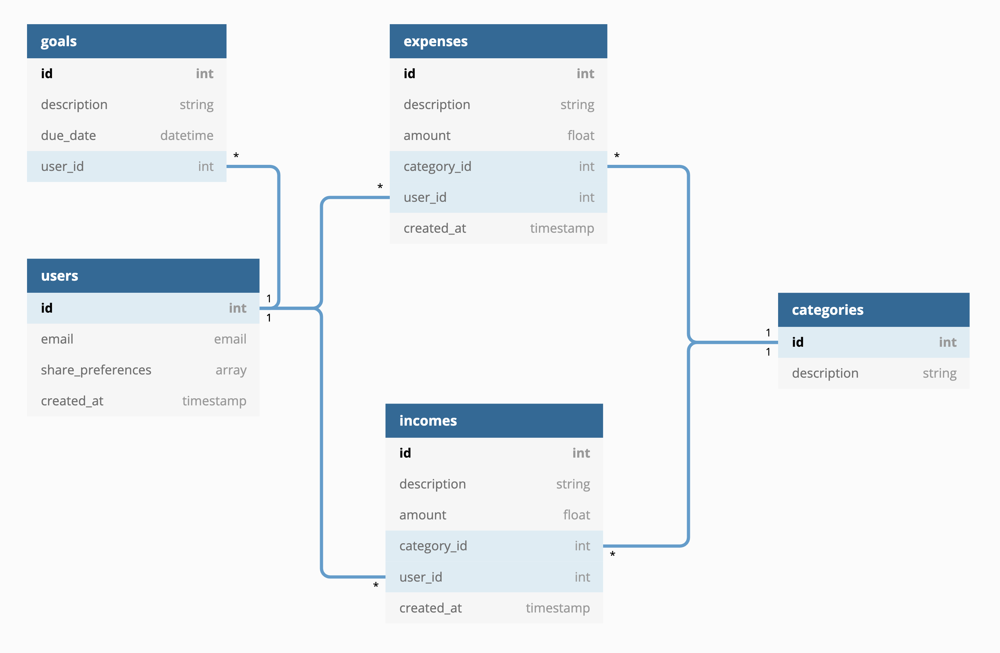
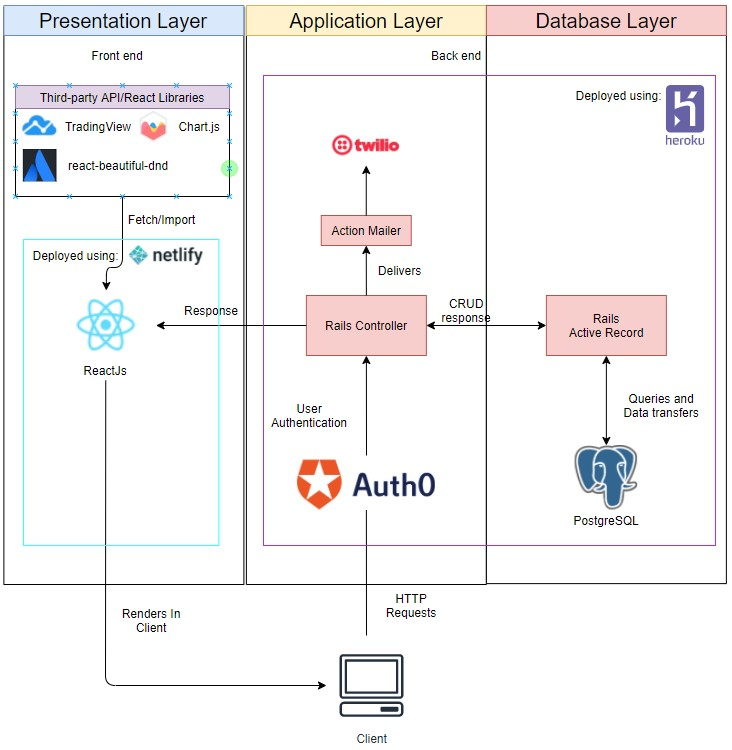
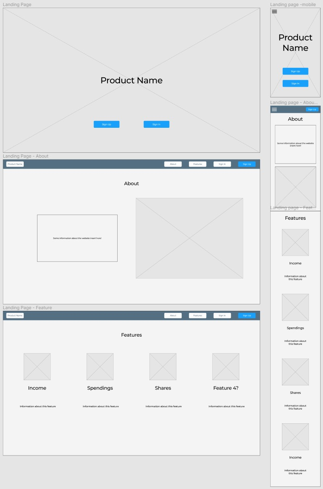
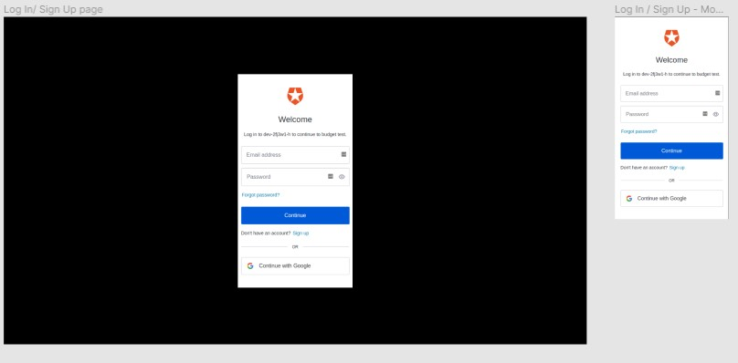
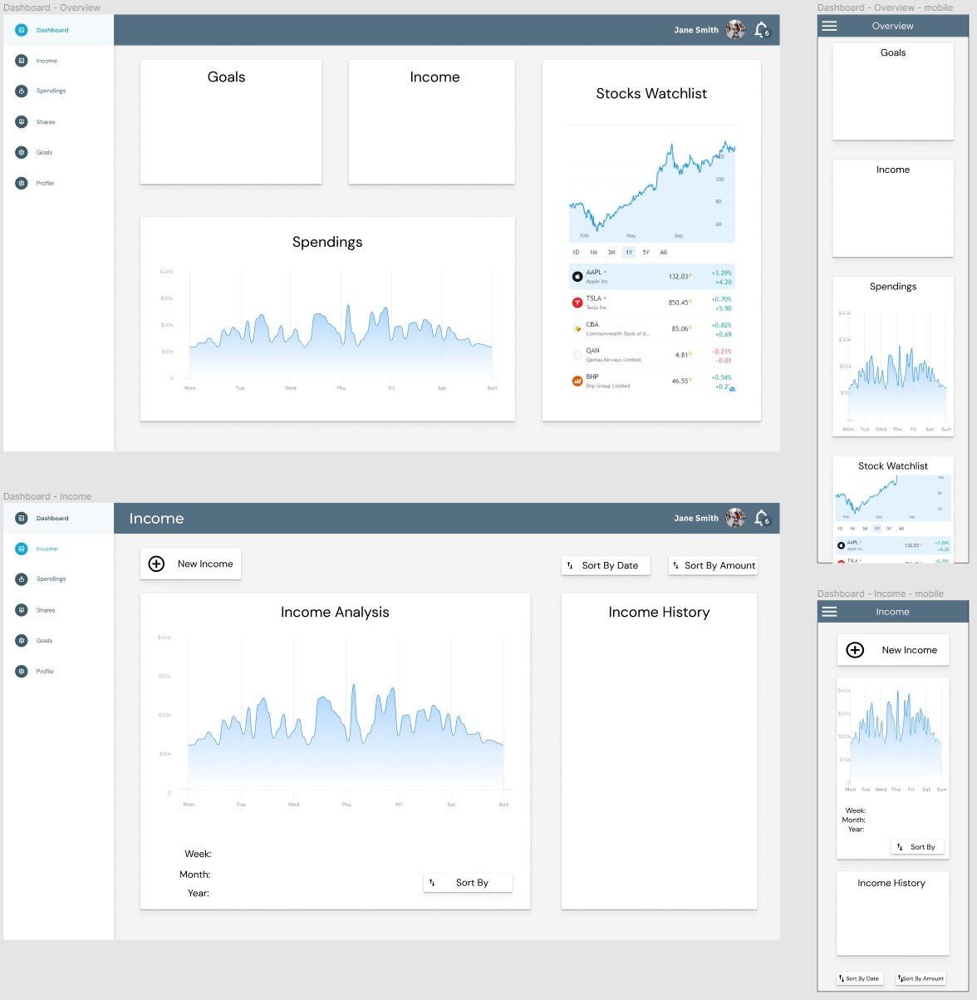
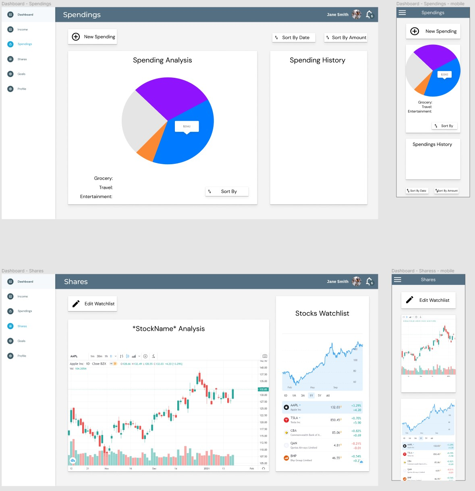
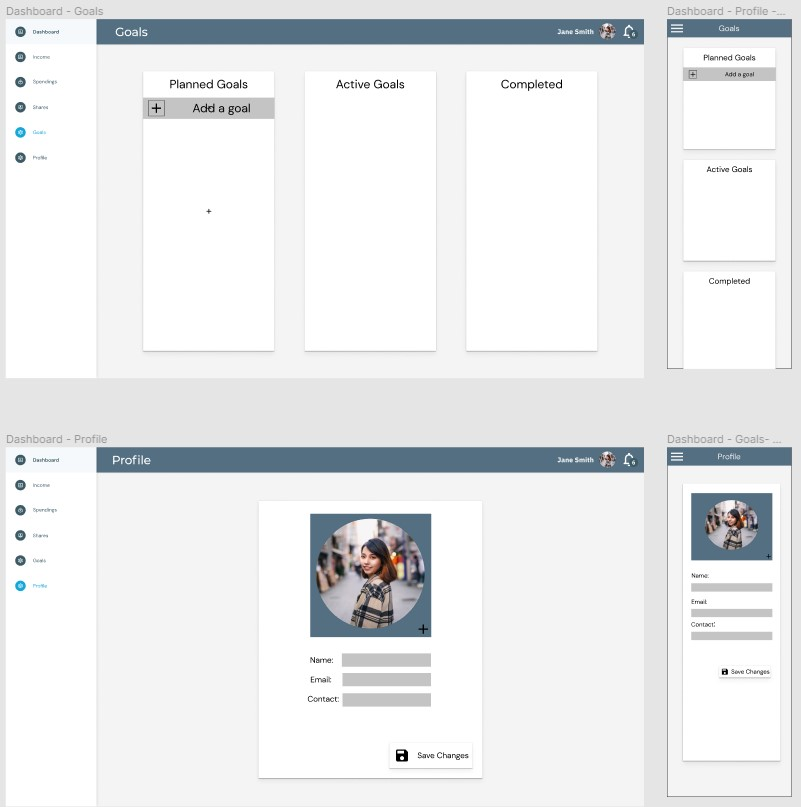

# T3A2 Budget-Tracker
Budget Tracking App created for Coder Academy T3A2 Full Stack assignment 

## Purpose
- 2020 has been a financially hard year worldwide so now, more than ever, it is important to implement a budget. But without a way to track your budget, there is no point making one.    
- This web application is designed to be a simple one stop shop for anyone who is wanting to track their personal expenses, incomes and shares without all the clutter.

## Functionality and features 
- By providing a simple, responsive and fluid user-interface, it allows people to view and adjust their budget at any time, no matter the device.  
- Integration of a fully featured real-time share and market tracking chart, storing user preferences and allowing them to focus on what matters.
- A range of other metric tracking charts will be implemented, to allow people to select and visually interpret things such as categories of expenses or their monthly expenditure.

## Target Audience
- The intended audience for this application is targeted towards users that are looking keep their finances and expenses under control. Users that own shares will also be able to find use out of this application by having a watch-list and real-time tracking graph analysis for shares of their choice.

## Tech Stack

#### *Frontend*
- React using Material-UI styled components

#### *Backend*
- Rails API
- PostgreSQL database
- Auth0 authorization + authentication
- JWT tokens

#### *External Resources*
- TradingView finance widgets for tracking shares 
- ChartJS, displaying data on a range of charts
- React-beautiful-dnd
- Heroku web deployment platform
- Netlify deployment

#### *Testing*
- Rspec - For testing Rails code
- Jest + Cypress - For testing React/Javascript code

## Dataflow Diagram

### Entity Relational Diagram

## Application Architecture Diagram

## User Stories

#### User
- As Stacy, I want to be greeted with a landing page, so that I can see the benefits of the website before I sign up
- As Stacy, I want to be able to create an account, so that I can use this service and track my budget
- As Max, I want to be able to update my account, so that I have my most up to date information
- As Max, I want to be able to update my password, so that I can keep my account safe
- As Max, I want to be able to reset my password, so that I can keep using this service if I forget it
- As Cam, I want to be able to log in, so that I know that my data is safe and secure
- As Cam, I want to be able to log out, so that I can leave my device and know people won't be able to access my information

#### Expenses
- As John, I want to be able to enter an expense via a form, so that I can track all my expenses for the month/year
- As John, I want to be able to add an expense description, so that I can remember the purchase and look for trends in spending  
- As John, I want to be able to add an expense price, so that I can track how much I am spending 
- As John, I want to be able to add an expense category/s, so that I can organise my spending
- As Samantha, I want to be able to edit any expenses I have entered, so that I can ensure the data is correct if I make a mistake
- As Samantha, I want to be able to delete any expenses I have entered, so that I can ensure that only the expenses I have displayed are relevant
- As Tim, I want to be able to view my monthly expenses, so that I can get a more detailed breakdown of what I am spending my money on
- As Tim, I want to be able to view my yearly expenses to date, so that I can be sure of how much money I have spent this year

#### Income
- As Holly, I want to be able to add an income via a form, so that I can track all my incomes for the month/year
- As Holly, I want to be able to add an income description, so that I can remember the reason for the income
- As Holly, I want to be able to add an income price, so that I can track how much income I am receiving
- As Holly, I want to be able to add an income category/s, so that I can organise my income
- As Samantha, I want to be able to edit any incomes I have entered, so that I can ensure the data is correct if I make a mistake
- As Samantha, I want to be able to delete any incomes I have entered, so that I can ensure that only the incomes I have displayed are relevant
- As Ben, I want to be able to view my monthly income, so that I can get a more detailed breakdown of where my money is coming from
- As Ben, I want to be able to view my yearly income to date, so that I can be sure of how much money I have earned this year

#### Categories
- As Tim, I want to be able to sort expenses based on categories, so that I can have a overall breakdown in which categories I spend most of my money on
- As Tim, I want to be able to view my categories in a range of charts, so that I can get a visual representation of my spending habits

#### Shares
- As Jimmy, I want to be able to view my selection of shares, so that I am able to keep track of how my share prices are doing
- As Jimmy, I want to be able to have a watch-list of my preferred shares, so that I can keep track of shares that I own/interested in
- As Jimmy, I want to be able to customise my own watch-list, so that I can have a choice on which shares appear on my watch-list

#### Financial Goals
- As Beth, I want to be able to create a list of my financial goals, so I have something to aspire towards
- As Beth, I want to be able to add a goal description, so the goal has relevance
- As Beth, I want to be able to add a goal due date, to keep inline with SMART goal setting practices
- As Abbey, I want to move the goals into different buckets depending on status, so I can keep my goals on track for the year and
- As Abbey, I want to be able to complete and archive my financial goals, so I can refer to them in the future

## Wireframes

Link to Figma: https://www.figma.com/file/mm5X1Hgvh8IKJkEOKF8ahQ/Wireframe-T3A2?node-id=0%3A1

#### Landing Page

 
#### Log In & Sign up Page

 
#### Dashboard Page

## Screenshots of Trello board

Link to Trello board: https://trello.com/b/FQHhNQvr/t3a2-full-stack-app

